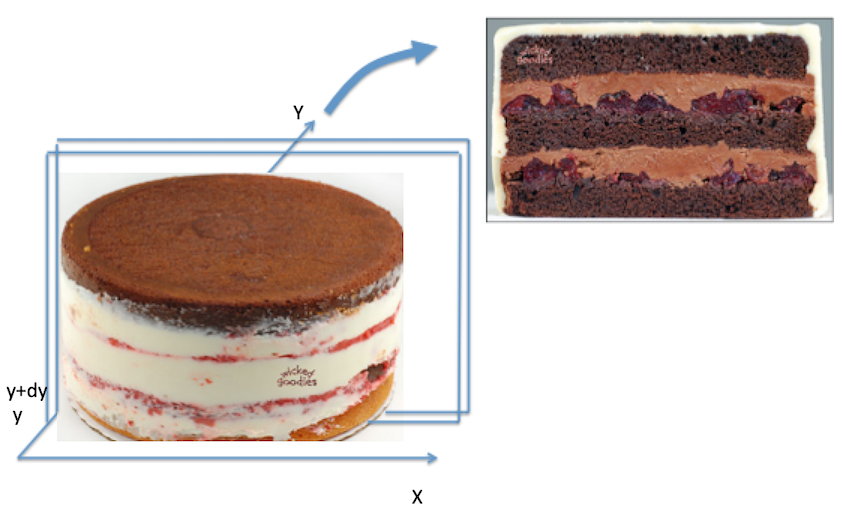

# Defining Random Variables

```{r load packages unit 02, echo=FALSE}
library(tidyverse)
```

## Learning Objectives 

At the end of this week's course of study (which includes the async, sync, and homework) students should be able to 

1. **Remember** that random variable are neither random, or variables, but instead that they are  a foundational object that we can use to reason about a world. 
2. **Understand** that the intuition developed by the use of set-theory probability maps into the more expressive space of random variables
3. **Apply** the appropriate mathematical transformations to move between joint, marginal, and conditional distributions.

From the axioms of probability, it is possible to build a whole, expressive modeling system (that need not be grounded **at all** in the minutia of the world). With this probability model in place, we can describe how frequently events in the random variable will occur. When variable are dependent upon each other, we can utilize information that is encoded in this dependence in order to make predictions that are *closer to the truth* than predictions made without this information. 

There is both a beauty and a tragedy when reasoning about random variables: we describe random variables using their joint density function. 

The beauty is that by reasoning with such general objects we can produce guarantees that hold in every case, no matter the function that stands in for the joint density function. 

The tragedy is that in the "real world", the world where we are going to eventually going to train and deploy our models, we are never provided with this joint density function.  In examples that we compute, to provide a chance to reason about these objects, we will typically write down a *specific* function that a random variable represents, despite the limitation that we cannot directly observe this function in the wild. 

## Class Announcements

### Homework 

1. You should have turned in your first homework. The solution set for this homework is scheduled to be released to you in two days. The solution set contains a full explanation of how we solved the questions posed to you. You can expect that feedback for this homework will be released back to you within seven days. 
2. You can start working on your second homework when we are out of this class. 

### Study Groups 

It is a **very** good idea for you to create a recurring time to work with a set of your classmates. Working together will help you solve questions more effectively, quickly, and will also help you to learn how to communicate what you do and do not understand about a problem to a group of collaborating data scientists. And, working together with a group will help you to find people who share data science interests with you. 

### Course Resources 

There are several resources to support your learning. A learning object last week was that you would be introduced to each of these systems. Please continue to make sure that you have access to the: 

- [Library VPN](https://www.lib.berkeley.edu/using-the-libraries/vpn) to read all of the scholarly content in the known universe, including the course textbook. 
- [Course LMS Page](https://www.learn.datascience.berkeley.edu) 
- 

## Using Definitions of Random Variables

### Random Varaible 

What is a random variable? Does this definition help you? 

```{definition, name = "Random Variable"}
A random variable is a function $X : \Omega \rightarrow \mathbb{R},$ such that $\forall r \in \mathbb{R}, \{\omega \in \Omega\}: X(\omega) \leq r\} \in S$. 
```

Someone, please, read that without using a single "omega", $\mathbb{R}$, or other jargon terminology. Instead, someone read this aloud and tell us what each of the concepts mean. 

The goal of writing with math symbols like this is to be *absolutely* clear what concepts the author does and does not mean to invoke when they write a definition or a theorem. In a very real sense, this is a language that has specific meaning attached to specific symbols; there is a correspondence between the mathematical language and each of our home languages, but exactly what the relationship is needs to be defined into each student's home language. 

- What are the key things that random variables allow you to accomplish? 
  - Suppose that you were going to try to make a model that predicts the probability of winning "big money" on the machine. Big money might be that you get :cherries: :cherries: :cherries:. Can you do *math* with :cherries:?

Why do we say that random variables are functions? Is there some useful property of these being functions rather than any other quantity?

### Functions of Functions

```{definition, name = "Function of a Random Variable", label = "fxn"}
Let $g : U \rightarrow \mathbb{R}$ be some function, where $X(\Omega) \subset U \subset \mathbb{R}$. Then, if $g \circ X : \Omega \rightarrow \mathbb{R}$ is a random variable, we say that $g$ is a *function* of X and write $g(X)$ to denote the random variable $g \circ X$.  
```

If a random variable is a function from the real world, or the sample space, or the outcome space to a real number, then what does it mean to define a function of a random variable? 

- At what point does this function work? Does this function change the sample space that is possible to observe? Or, does this function change the real-number that each outcome points to? 

```{example, name = "MNIST"}
Suppose that you are doing some image processing work. To keep things simple, that you are doing image classification in the style of the MNIST dataset. 

- Can someone describe what this task is trying to accomplish? 
- Has anyone done work like this? 
  
However, suppose that rather than having good clean indicators for whether a pixel is on or off, instead you have weak indicators -- there's a lot of grey. A lot of the cells are marked in the range $0.2 - 0.3$.  

1. How might creating a function that re-maps this grey into more extreme values help your model? 
2. Is it possible to "blur" events that are in the outcome space? Does this "blurring" meet the requirements of a function of a random variable, as provided above? 
```

## Pieces of a Random Variable 

When you look at the definition of a random variable, there are two key pieces that must exist for every random variable. What are these pieces? As a hint, we actually developed one of these key pieces *last* week when we were discussing elementary probability. 

```{definition, name = "Random Variable, Suite"}
A random variable is a function $X : \Omega \rightarrow \mathbb{R},$ such that $\forall r \in \mathbb{R}, \{\omega \in \Omega\}: X(\omega) \leq r\} \in S$. 
```

1. 
2. 

### Probability Density Functions and Cumulative Density Functions 

- What is a probability mass function? 
- What do the **Kolmogorov Axioms** mean must be true about any probability mass function (*pmf*)? 

```{example, name = "Berkeley Drivers, No Survivors"} 
You should try driving in Berkeley some time. It is a **trip**! Without being deliberately ageist, the city is full of ageing hippies driving subarus and making what seem to be stochastic right-or-left turns to buy incense, pottery, or just sourdough bread. 

Suppose that you are walking to campus, and you have to cross 10 crosswalks, each of which are spaced a block apart. Further, suppose that as you get closer to campus, there are fewer aging hippies, and therefore, there is decreasing risk that you're hit by a Subaru as you cross the street. Specifically, and fortunately for our math, the risk of being hit decreases linearily with each block that you cross. 

Finally, campus provides you with the safety reports from last year, and reports that there were 120 student-subaru incideces last year, out of 10,000 student-crosswalk crossings. 

1. What is the *pmf* for the probability that you are involved in a student-subaru incident as you walk across these 10 blocks? What sample space, $\Omega$ is appropriate to represent this scenario? 
2. Suppose that you don't leave your house -- this is a remote program after all! What is your cumulative probability of being involved in a student-subaru incident?  
3. What is the cumulative probability *cmf* for the probability that you are involved in a student-subaru incedent? 
4. Suppose that you live three blocks from campus, but your classmate lives five blocks from campus. What is the difference in the cumulative probability? 
5. How would you describe the cumulative probability of being hit as you walk closer to campus? That is, suppose that you start 10 blocks away from campus, and are walking to get closer. Is your cumulative probability of being hit on your way to campus increasing or decreasing as you get closer to campus? 
6. How would you describe the cumulative probability of being hit as you walk **further** from campus? That is, suppose that you start on campus, and you're walking to a bar after classes. Is your cumulative probability of being hit on your way away from campus increasing or decreasing as you get further from campus? 
```

## Discrete & Continuous Random Variables

What, if anything is fundamentally different between discrete and continuous random variables? As a way of starting the conversation, consider the following cases: 

- Suppose $X$ is a random variable that describes the time a student spends on w203 homework 1.
  - If you have only granular measurement -- i.e. the number of nights spent working on the homework -- is this discrete or continuous? 
  - If you have the number of hours, is it discrete or continuous? 
  - If you have the number of seconds? Or milliseconds? 
- Is it possible that $P(X = a) = 0$ for every point $a$? For example, that $P(X = 3600) = 0$. 
- Does one of these measures have more *information* in it than another?
  - How are measurement choices that we make as designers of information capture systems -- i.e. the machine processes, human processes, or other processes that we are going to work with as data scientists -- reflected in both the amount of information that is gathered, the type of information that is gathered, and the types of random variables that are manifest as a result? 

## Moving Between PDF and CDF 

The book defines *pmf* and *cmf* first as a way of developing intuition and a way of reasoning about these concepts. It then moves to defining continuous density functions, which is many ways are easier to work with although they lack the means of reasoning about them intuitively. Continuous distributions are defined in the book, and more generally, in terms of the *cdf*, which is the cumulative density function. There are technical reasons for this choice of definition, some of which are signed in the footnotes on the page where the book presents it. 

More importantly for this course, in **Definition 1.2.15** the book defines the relationship between *cdf* and *pdf* in the following way:

```{definition, name = "Probability Density Function (PDF)"}
For a continous random variable $X$ with CDF $F$, the *probability density function* of $X$ is 

$$
  f(x) = \left. \frac{d F(u)}{du} \right|_{u=x}, \forall x \in \mathbb{R}.
$$  
```

- How does this definition, which relates *pdf* and *cdf* by a means of differentiation and integration, fit with the ideas that we just developed in the context of walking to and from campus?  

```{example, name = "Working with a continuous pdf and cdf"}
Suppose that you learn than a particular random variable, $X$ has the following function that describes its *pdf*, $f_{x}(x) = \frac{1}{10}x$. Also, suppose that you know that the smallest value that is possible for this random varaible to obtain is 0. 

1. What is the CDF of $X$? 
2. What is the maximum possible value that $x$ can obtain? How did you develop this answer, using the Kolmogorov axioms of probability? 
3. What is the cumulative probability of an outcome up to 0.5? 
4. What is the probability of an outcome between 0.25 and 0.75? Produce an answer to this in two ways: 
  1. Using the $pdf$
  2. Using the $cdf$
```

## Joint Density 

Working with a single random variable helps 

## Visualizing Distributions Via Simulation

### The Visualization Trick

Here is the true density function for a normal random variable.

```{r, echo = FALSE, fig.height=3}

d <- data.frame(
  x = seq(from = 0, to = 4, by = 0.01)) %>%  
  mutate(
    y = dnorm(x, mean = 2, sd = 1)
    )

d %>%  
  ggplot() + 
  aes(x = x, y = y) + 
  geom_line()
```

**Simulate Draws** 

There's another way to get an **approximate** idea of what the distribution looks like.  Here's how we take a single draw from a normal distribution with a specific set of features:

```{r}
rnorm(n = 1, mean = 2, sd = 1)
```

**Repeating the Experiment**

We want to rerun that experiment 10 times.  We take a draw, then rewind time, clear our memory and start over with fresh randomness.  To do this in R, an easy way is with the `replicate()` function.  Change the code below so that it repeats the experiment above 10 times, then use `hist()` to display a plot of the result. 

```{r}
simulation <- replicate(
  n    = 10,      # should you change this line? 
  expr = 1 + .2   # or this line? 
  )

simulation
```

**Better Visualization**

Here's some fancy ggplot code to draw a nice histogram of the result, along with the true density.  Remove the first line to make it work with your simulation.


```{r}
short_simulation <-  c(1,2,3,2,4,2)

true_density <- function(x) {
  dnorm(x = x, mean = 2, sd = 1)
  }

dat_hist <- data.frame(short_simulation)

dat_hist %>% 
  ggplot() + 
  geom_histogram(
    aes(x = short_simulation, y = ..density..)) + 
  stat_function(
    aes(x = short_simulation), fun = true_density, color = 'darkred')
```


**Repeating the Experiment: Questions**

- What happens to your plot as you increase the number of draws from 10 to 100 to 1000...?
- In your own words, what is the difference between the distribution and the sample you are taking?

**The Visualization Trick** 

- This is a pretty useful *trick*.  
- The repetition we're using has no analogue in the real world -- we don't get to shake up the world like a snow globe a number of times in a row to see what it does.
- But, when we say "take a draw from the distribution" another way to say this is that we're *simulating* the random variable.

### Apply the Visualization Trick

**Part I** 

- How can the visualization trick help us?  Here's a problem:

  - Suppose $X$ and $Y$ are independent normal random variables, both with mean 2 and standard deviation 1.  Say $Z = X + Y$.  
  - What is the distribution of $Z$?

- We could do some math to compute the density function of $Z$, but it's actually quite messy.  Instead, let's use the visualization trick to get an approximate idea.

**Part II**

- First, write an R function to simulate a single draw from $Z$.  

1. Simulate a draw for $X$.
2. Simulate a draw $Y$. 
3. Return the sum of the previous draws.

```{r}
rz <- function() {
  2 # Replace with your code
}
```

- Use the previous code to repeat this experiment 10,000 times and plot a histogram.
- See if you can guess what the the distribution is, and plot your guess on the histogram.

### How is simulation useful? 

- Are there situations that you think simulation of this sort might be useful? 

## Computing Different Distributions.

Suppose that random variables $X$ and $Y$ are jointly continuous, with joint density function given by,

$$
f(x,y) = 
  \begin{cases}
    c, & 0 \leq x \leq 1, 0 \leq y \leq x \\
    0, & otherwise
\end{cases}
$$

where $c$ is a constant.

1. Draw a graph showing the region of the X-Y plane with positive probability density.
2. What is the constant $c$?
3. Compute the marginal density function for $X$.  (Be sure to write a complete expression)
4. Compute the conditional density function for $Y$, conditional on $X=x$.  (Be sure to specify for what values of $x$ this is defined)

## Understanding Joint Distributions 

- In this picture, we imagine putting a cake down on the X-Y plane.
- Take a sharp knife and make two cuts parallel to the X-axis.  one is at $Y = y$, the other at $Y = y + dy$.



**Review of Terms** 

Remember some of the key terms we learned in the async:

- Joint Density Function
- Conditional Distribution
- Marginal Distribution

Explain each of these three in terms of the cake metaphor.

## Working with a Shiny App

```{r, out.width='600px'}
knitr::include_app(url = 'http://statistics.wtf/betahat/', height = '1200px')
```

