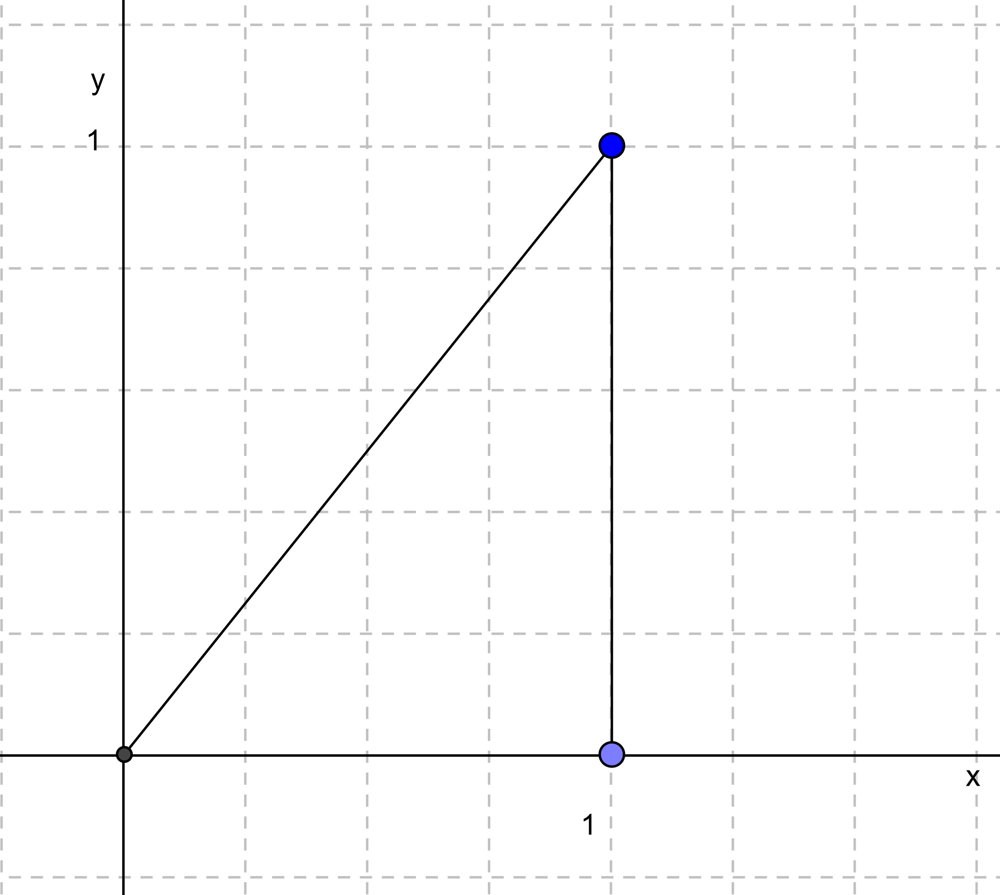

# Conditional Expectation and The BLP

## Learning Objectives 

1. 
2. 
3. 

## Class Announcements

## Roadmap 

**Roadmap -- Rearview Mirror** 

- Statisticians create a population model to represent the world.
- $E[X], V[X], Cov[X,Y]$ are "simple" summaries of complex joint distributions, which are hooks for our analyses. 
- They also have useful properties -- for example, $E[X + Y] = E[X] + E[Y]$.

**Roadmap -- This week** 

- We look at situations with one or more "input" random variables, and one "output."
- Conditional expectation summarizes the output, given values for the inputs.
- The conditional expectation function (CEF) is a predictor -- a function that yields a value for the output, give values for the inputs.
- The best linear predictor (BLP) summarizes a relationship using a line / linear function.

**Roadmap -- Coming Attractions** 

- OLS regression is a workhorse of modern statistics, causal analysis, etc
    - It is also the basis for many other models in classical stats and machine learning
- The target that OLS estimates is exactly the BLP, which we're learning about this week.

## Conditional Expectation Function (CEF)

- Expectation of $Y$:
$$
E[Y] = \int_{-\infty}^\infty y \cdot f_{Y}(y) dy
$$
- Conditional expectation of $Y$ given $X=x \in \text{Supp}[X]$: 
$$
E[Y|X=x] =  \int_{-\infty}^\infty y \cdot f_{Y|X}(y|x) dy
$$

- Compare and contrast $E[Y]$ and $E[Y|X]$. For example, how are their components similar or different? 
- What is $E[Y|X]$ a function of? What are "input" variables to this function?
- What is $E[E[Y|X]]$ a function of? 

::: notes 

- (Question 1) In both, we have a probability density function multiplied by the values that we realize; this is basically serving as a "weighting" function, we're merely changing what that weighting function is! 
- In both cases we're looking at a "mean" of a distribution -- in one it is just a "conditional mean" than a "marginal mean". 

- (Question 2) We integrate $Y$ out completely by using its every value in the integral, so $E$ will not have $Y$ in the answer -- instead, it will remain a function of $X$. 
- $f_{Y|X=x}$ is a function of $x$! So, the conditional expectation is some function $x$ as well.
- (Optional to discuss; probably too minute) An observation that some parsing students will make: 
  - Without fixing $X$ to some realization (denoted as a "little x", $x$, then $E[Y|X]$ is a function of $X$ and so the whole statement is a function of a random variable (i.e. $E[Y|X]$ is *itself* a RV). 
  - Once we fix $X=x$, then $E[Y|X=x]$ is fixed to some constant -- there is one value that $E[Y|X=x]$ maps to. 

- (Question 3) That isn't a function of anything! Once you've computed $E[E[Y|X]]$, you've integrated out all variables! 
::: 

## Computing the CEF

- Suppose that random variables $X$ and $Y$ are jointly continuous, with joint density function given by,

$$
f(x,y) = 
  \begin{cases}
    2, & 0 \leq x \leq 1, 0 \leq y \leq x \\
    0, & otherwise
\end{cases}
$$

{width=50%}

- In week 2 we computed the conditional density of this function: 

$$
f_{Y|X}(y|x) = 
  \begin{cases}
    \frac{1}{x}, & 0 \leq y \leq x \\ 
    0, & \text{otherwise}
  \end{cases}
$$

- What is the conditional expectation function? 
- What is the conditional variance function? 

::: notes 

::: 

## Group Exercise

### Minimizing MSE

- Theorem 2.2.20 states: 

> The CEF $E[Y|X]$ is the "best" predictor of $Y$ given $X$, where "best" means it has the smallest mean squared error (MSE).

- **Task:** Justify every transition ("=" sign) of the proof below using earlier FOAS concepts, definitions, theorems, calculus, and algebraic operations. 

- **Proof:** 
  - We need to find such function $g: R \to R$ that gives the smallest $E[(Y-g(X))^2]$. 
  - It should turn out that $g(X)$ is actually $E[Y|X]$.

- Deriving a Function to Minimize MSE

\begin{align*}
  E[(Y - g(X))^2|X]
      &= E[Y^2 - 2Yg(X) + g^2(X)|X]                   \\
      &= E[Y^2|X] + E[-2Yg(X)|X] + E[g^2(X)|X]      \\
      &= E[Y^2|X] - 2g(X)E[Y|X] + g^2(X)E[1|X]      \\
      &= (E[Y^2|X] - E^2[Y|X]) + (E^2[Y|X] - 2g(X)E[Y|X] + g^2(X)) \\
      &= V[Y|X] + (E^2[Y|X] - 2g(X)E[Y|X] + g^2(X)) \\
      &= V[Y|X] + (E[Y|X] - g(X))^2                  \\
\end{align*} 

- Then we have: 
\begin{align*}
  E[(Y-g(X))^2] &= E\big[E[(Y-g(X))^2|X]\big] \\ 
    &=E\big[V[Y|X]+(E[Y|X]-g(X))^2\big]\\
    &=E\big[V[Y|X]\big]+E\big[(E[Y|X]-g(X))^2\big]\\
\end{align*}

- $E[V[Y|X]]$ doesn't depend on $g$; and, 
- $E[(E[Y|X]-g(X))^2]\ge 0$.

$\therefore g(X) = E[Y|X]$ gives the smallest $E[(Y-g(X))^2]$

- **Implication:** If you are choosing some $g$, you can't do better than $g(x) = E[Y|X=x]$.

### Working with the BLP

Why Linear?

- In some cases, we might try to estimate the CEF. More commonly, however, we work with linear predictors. Why? 

::: notes
- We don't know joint density function of $Y$. So, it is "difficult" to derive a suitable CEF. 
- To estimate *flexible* functions requires considerably more data. Assumptions about distribution (e.g. a linear form) allow you to leverage those assumptions to learn 'more' from the same amount of data. 
- Other times, the CEF, even if we *could* produce an estimate, might be so complex that it isn't useful or would be difficult to work with. 
- And, many times, linear predictors (which might seem trivially simple) actually do a very good job of producing predictions that are 'close' or useful. 
::: 

### Joint Distribution Practice

#### Professorial Mistakes (Discrete RVs)

- Let the number of questions that students ask be a RV, $X$.  
- Let $X$ take on values: $\{1, 2, 3\}$, each with probability $1/3$.  
- Every time a student asks a question, the instructor answers incorrectly with probability $1/4$, independently of other questions.
- Let the RV $Y$ be number of incorrect responses.

- **Questions:** 
  - Compute the expectation of $Y$, conditional on $X$, $E[Y|X]$ 
  - Using the law of iterated expectations, compute $E[Y] = E\big[E[Y|X]\big]$. 

#### (Bonus Questions) 
- Working with the same question from the last slide: 
  - Compute the expectation of the product of $X$ and $Y$, $E(XY)$
  - Using the previous result, compute $\text{cov}(X,Y)$.

