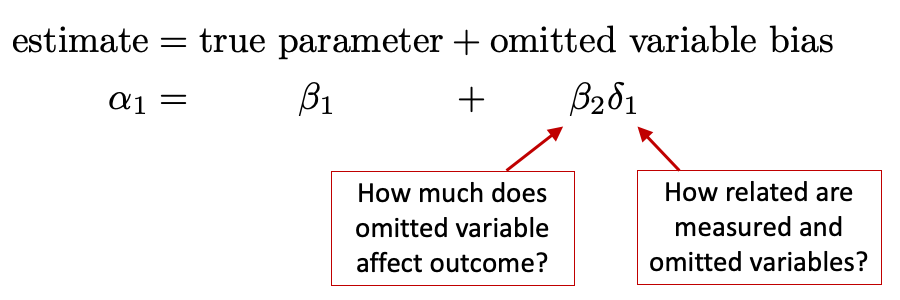
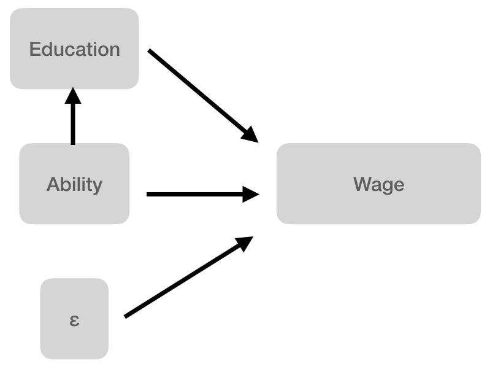

# Explanatory Model Building

{width=80%}

## Learning Objectives 

1. 
2. 
3. 

## Class Announcements

**Lab 2-Regression**

**Overview**

- **Setting**: You are data scientists for a maker of products.
- **Task**: You select your own research question
    - Your X should be an aspect of product design
    - Your Y should be a metric of product success
- **Deliverable**: A statistical analysis that includes
    - An introduction that motivates your research question
    - A description of your model-building process
    - A discussion of statistical assumptions that may be problematic
    - A well-formatted regression table with a minimum of 3 specifications
    - A conclusion that extracts key lessons from your statistical results
 
**The Report**    
- Writing for a collaborating data scientist, what research question have you asked, what answers have you found, and how did you find them? 

| Deliverable Name     | Week Due | Grade Weight |  
|----------------------|----------|--------------| 
| Research Proposal    | Week 12  | 10%          | 
| Within-Team Review   | Week 12  | 5%           | 
| Final Presentation   | Week 14  | 10%          | 
| Final Report         | Week 14  | 75%          | 

**Team Work Evaluation**

- Most data science work happens on teams.
- Our educational goals include helping you improve in your role as a teammate.
- We'll ask you to fill out a confidential evaluation regarding your team dynamics.

**Final Presentation**

- Team will present their work in live session 14. 
  - Teams have between 10-15 min dedicated to discussing their work (depending on section size)
  - Two-thirds of the time can be the team presenting
  - **BUT** at least one-third should be asking and answering questions with your peers
  - For example, if teams have 15 minutes total, then plan to present for no more than 10 minutes and structure 5 minutes of questions. 

## Roadmap
**Rearview Mirror**

- Statisticians create a population model to represent the world.
- The BLP is a useful way to summarize relationships in a model, and OLS regression is a way to estimate the BLP.
- OLS regression is a foundational tool that can be applied to questions of description

**Today**

- Questions of explanation require a substantially different modeling process.
- To answer causal questions, we must work within a causal theory
- OLS regression is sometimes appropriate for measuring a causal effect, 
- But, only when the model estimated matches the causal theory. 
- So, we must watch out for omitted variable bias, reverse causality, and outcome variables on the right hand side.

**Looking Ahead**

- The famous Classical Linear Model (CLM) allows us to apply regression to smaller samples.
- We will address the pervasive issue of false discovery, and ways to be a responsible member of the scientific community.

## Discussion
### Path Diagrams

$$
\begin{matrix}
\\
\text{Sleep} \rightarrow \text{Feelings of Stress} \\
\\
\end{matrix}
$$ 

- How would the following fit into this causal path diagram?
  1. All the other factors in the world that also cause stress but don't have a causal relationship with sleep. 
  2. A factor: Coffee Intake 
      - What happens if you omit it in your regression?
  3. Reverse causality
  4. An outcome variable on the RHS: Job Performance
      - What happens if you include it in your regression?

### Omitted Variable Bias

- Recall the equation for omitted variable bias

{width=80%}

- What specific regressions do $\beta_2$ and $\gamma_1$ come from?

## R Exercise
**Omitted Variable Bias in R**

The file `htv.RData` contains data from the 1991 National Longitudinal Survey of Youth, provided by Wooldridge.  All people in the sample are males age 26 to 34.  The data is interesting here, because it includes education, stored in the variable `educ`, and also a score on an ability test, stored in the variable `abil`. 

Assume that the true model is,

{width=80%}

**Questions:** 

1- Are we able to *directly* measure ability? If so, how would you propose to measure it? 

2- If not, what *do* we measure and how is this measurement related to ability?   And there is a lot of evidence to suggest that standardized tests are not a very good proxy.  But for now, let's pretend that we really are measuring ability.

3- Using R, estimate (a) the true model, and (b) the regression of ability on education. 
   
   - Write down the expression for what omitted variable bias would be if you couldn't measure ability.  
   
   - Add this omitted variable bias to the coefficient for education to see what it would be.

4- Now evaluate your previous result by fitting the model, $$wage = \alpha_0 + \alpha_1 educ + w$$
   
   - Does the coefficient for the relationship between education and wages match what you estimated earlier? 
   
   - Why or why not? 

5-  Reflect on your results: 
   
   - What does the direction of omitted variable bias suggest about OLS estimates of returns to education?  
   
   - What does this suggest about the reported statistical significance of education?

## Discussion 
**The Direction of Omitted Variable Bias**

- For each regression, estimate whether omitted variable bias is towards zero or away from zero.

| Regression Output                               | Omitted Variable                |
|-------------------------------------------------|---------------------------------|
| $\widehat{grade} = 72.1 + 0.4\ attendance$      | $time\_studying$                |
| $\widehat{lifespan} = 87.4 - 1.2\ cigarettes$   | $exercise$                      |
| $\widehat{lifespan} = 87.4 - 1.2\ cigarettes$   | $time\_socializing$             |
| $\widehat{wage} = 14.0 + 2.1\ grad\_education$  | $experience$                    |
| $\widehat{wage} = 14.0 + 2.1\ grad\_education$  | desire to effect $social\_good$ |
| $\widehat{literacy} = 54 + 12\ network\_access$ | $wealth$                        |