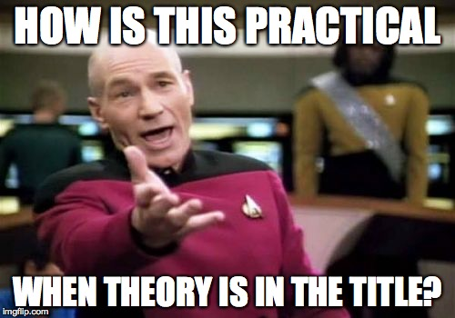

# Probability Spaces

## Learning Objectives 

At the end of this week's learning, student will be able to: 

1. *Find* and *access* all of the course materials
2. *Develop* a course of study that is builds toward success
3. *Apply* ... 

## What can you learn in this class? 

- Probability theory
- Statistics
- Applying theory to data
- How statistics relates to other fields
- Composing a persuasive statistical analysis. 

## Instructor Introduction 

- 

## What does a statistician look like?

**A statistician looks like YOU!**

- It doesn't matter if you've never taken a stats class before, or if you're reviewing using this class. 
- It doesn't matter how old, young, tall, or short you are.
- It doesn't matter if you identify as a woman or a man or trans or non-binary.
- It does not matter what color your skin is.
- It does not matter what your sexual orientation is.

## Student Introductions

Please take 90 seconds to tell us:

- Where you dial in from
- What kind of work you do / are interested in

::: notes
Unfortunately, it's important to keep these intros to just 90 seconds, so there is time for everything we want to cover! 
:::

## Probability Theory

**Probability** 

- Probability is a system of reasoning that we use to model the world under incomplete information
- This model underlies virtually *every* other model you'll ever use

### Working with a Sample Space, Part I

1. **You roll two six-sided dice**: 
    1. How would you define an appropriate sample space, $\Omega$? 
    2. How many elements exist in $\Omega$? 
    3. What is an appropriate event space, and how many elements does it have?
    4. Give an example of an event.

### Working with a Sample Space, Part II

2. **For a random sample of 1,000 Berkeley students**:   
    1. How would you define an appropriate sample space, $\Omega$? 
    2. How big is $\Omega$? How many elements does it contain? 
    3. What is an example of an event for this scenario?
    4. Can a single person be represented in the space twice? Why or why not? 
    
### Working with a Sample Sapce, Part III

3. **Suppose that you're sitting in a surf lineup, and you have to pick a wave that is the right height. Too small, and you won't get anywhere, too large and you'll get crushed.** 
    1. What sample space is appropriate to represent the height of a single wave, $\Omega$? 
    2. How big is $\Omega$? How many elements does it contain? 
    3. What is an example of an event that could be part of the event space?
    4. What sample space is appropriate to represent the height of the next 10 waves?  How large is this sample space?
    
::: notes
To represent 10 waves, you should use $\mathbb{R}^{10}$.  It is an interesting mathematical fact that $\mathbb{R}$ and $\mathbb{R}^{10}$ actually have the same cardinality.  There exists a 1-to-1 function between these sets.
:::
    
    
### Proofs: Style Counts

In each week of a class, you are either caught up or behind.

- The probability that you are caught up in Week 1 is 0.7. 
- If you are caught up in a given week, the probability that you will be caught up in the next week is 0.7. 
- If you are behind in a given week, the probability that you will be caught up in the next week is 0.4. 
- **What is the probability that you are caught up in week 3?**

Identify as many ways to improve this proof as you can:

If you are caught up in a week, there are two possibilities for the previous week: caught up and behind.  Let $P(C)$ be the probability of being caught up.  In week 1, $P(C) = .7$.  The probability of being behind is $P(B) = 1 - .7 = .3$.  We first break down the probability for week 2:

$$P(C) = .7 \cdot .7 + .3 \cdot .4 = .65$$

Now we can repeat the process for week 3:

$$P(C) = .65 * .7 + .35 * .4 = .595$$

## Reminders

1. Welcome! 
2. Before next live session: 
    1. Complete the homework that builds on this unit
    2. Complete all videos and reading for unit 2

**Good luck getting started!**
