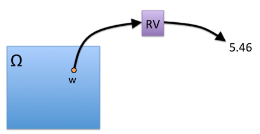
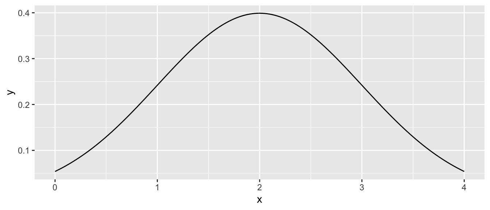
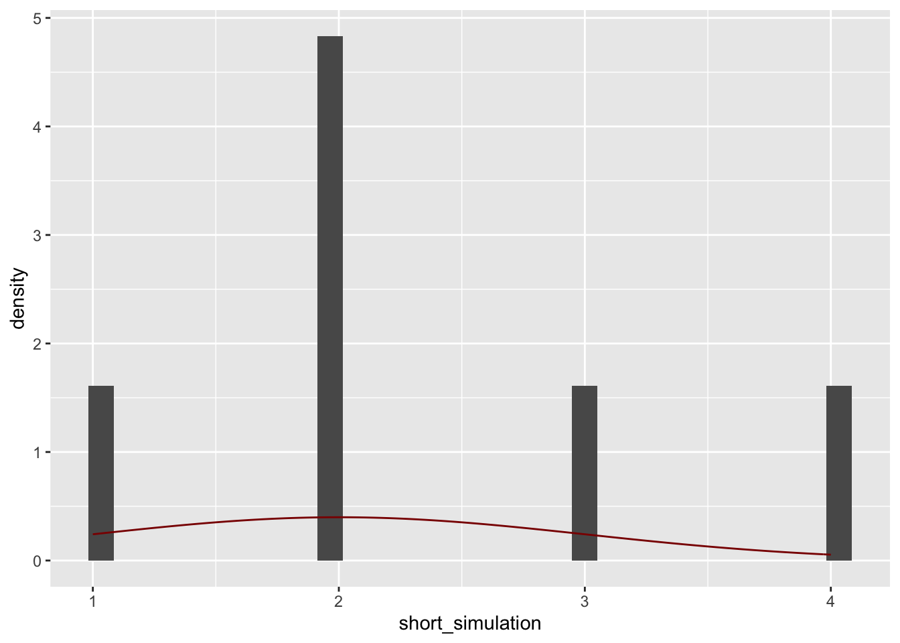

# Defining Random Variables


```
## ── Attaching packages ─────────────────────────────────────── tidyverse 1.3.0 ──
```

```
## ✓ ggplot2 3.3.5     ✓ purrr   0.3.4
## ✓ tibble  3.0.3     ✓ dplyr   1.0.1
## ✓ tidyr   1.1.1     ✓ stringr 1.4.0
## ✓ readr   1.3.1     ✓ forcats 0.5.0
```

```
## ── Conflicts ────────────────────────────────────────── tidyverse_conflicts() ──
## x dplyr::filter() masks stats::filter()
## x dplyr::lag()    masks stats::lag()
```


## Learning Objectives 

1. 
2. 
3. 


## Class Announcements

## Roadmap
**Rearview Mirror**

**Today**

**Looking Ahead**


## Random Variables

- Random variables are objects that we use to hold numerical representations of real-world phenomena
- We can use a probability model to model how frequently events in the random variable will occur 
- From the axioms of probability, we can build a whole, expressive modeling system (that need not be grounded **at all** in the minutia of the world) that is useful for making predictions
- We assert that there is a probability density (or distribution) function, but we never get to see it. 

## Random Variables: Questions
### Randomness 



1. Where does a RV's randomness come from?
2. If you select a person at random from the US population and measure their blood pressure, what does $\Omega$ represent?  What does $w$ represent?  What is the random variable?
3. Why do we need a random variable to represent blood pressure? Why can't we make predictions about blood pressure without random variables?    


### Car crashes and Random Variables

Suppose that you stand at an intersection for six hours one day and report the time of each crash you observe during the observation period.

- What sample space, $\Omega$, is appropriate to represent this scenario?
- Is $\Omega$ a finite or an infinite set? Is it countable or uncountable? 
- If the police department happens to care only about the number of crashes during the six-hour observation period, what random variable $X$ would represent this summary?
- Can you describe the range of your $X$? Is it finite or infinite?
- Is your $X$ a discrete or a continuous random variable?


### Discrete & Continuous Random Variables

- Suppose $X$ is a random variable that describes the time a student spends on w203 homework 1.
  - If you have only granular measurement -- i.e. the number of nights spent working on the homework -- is this discrete or continuous? 
  - If you have the number of hours, is it discrete or continuous? 
  - If you have the number of seconds? Or milliseconds? 
- Is it possible that $P(X = a) = 0$ for every point $a$? For example, that $P(X = 3600) = 0$. 


## Visualizing Distributions Via Simulation

### The Visualization Trick

Here is the true density function for a normal random variable.



**Simulate Draws** 

There's another way to get an **approximate** idea of what the distribution looks like.  Here's how we take a single draw from a normal distribution with a specific set of features:


```r
rnorm(n = 1, mean = 2, sd = 1)
```

```
## [1] 2.603463
```

**Repeating the Experiment**

We want to rerun that experiment 10 times.  We take a draw, then rewind time, clear our memory and start over with fresh randomness.  To do this in R, an easy way is with the `replicate()` function.  Change the code below so that it repeats the experiment above 10 times, then use `hist()` to display a plot of the result. 


```r
simulation <- replicate(
  n    = 10,      # should you change this line? 
  expr = 1 + .2   # or this line? 
  )

simulation
```

```
##  [1] 1.2 1.2 1.2 1.2 1.2 1.2 1.2 1.2 1.2 1.2
```

**Better Visualization**

Here's some fancy ggplot code to draw a nice histogram of the result, along with the true density.  Remove the first line to make it work with your simulation.


```r
short_simulation <-  c(1,2,3,2,4,2)

true_density <- function(x) {
  dnorm(x = x, mean = 2, sd = 1)
  }

dat_hist <- data.frame(short_simulation)

dat_hist %>% 
  ggplot() + 
  geom_histogram(
    aes(x = short_simulation, y = ..density..)) + 
  stat_function(
    aes(x = short_simulation), fun = true_density, color = 'darkred')
```

```
## `stat_bin()` using `bins = 30`. Pick better value with `binwidth`.
```




**Repeating the Experiment: Questions**

- What happens to your plot as you increase the number of draws from 10 to 100 to 1000...?
- In your own words, what is the difference between the distribution and the sample you are taking?

**The Visualization Trick** 

- This is a pretty useful *trick*.  
- The repetition we're using has no analogue in the real world -- we don't get to shake up the world like a snow globe a number of times in a row to see what it does.
- But, when we say "take a draw from the distribution" another way to say this is that we're *simulating* the random variable.

### Apply the Visualization Trick

**Part I** 

- How can the visualization trick help us?  Here's a problem:

  - Suppose $X$ and $Y$ are independent normal random variables, both with mean 2 and standard deviation 1.  Say $Z = X + Y$.  
  - What is the distribution of $Z$?

- We could do some math to compute the density function of $Z$, but it's actually quite messy.  Instead, let's use the visualization trick to get an approximate idea.

**Part II**

- First, write an R function to simulate a single draw from $Z$.  

1. Simulate a draw for $X$.
2. Simulate a draw $Y$. 
3. Return the sum of the previous draws.


```r
rz <- function() {
  2 # Replace with your code
}
```

- Use the previous code to repeat this experiment 10,000 times and plot a histogram.
- See if you can guess what the the distribution is, and plot your guess on the histogram.

### How is simulation useful? 

- Are there situations that you think simulation of this sort might be useful? 

## Computing Different Distributions.

Suppose that random variables $X$ and $Y$ are jointly continuous, with joint density function given by,

$$
f(x,y) = 
  \begin{cases}
    c, & 0 \leq x \leq 1, 0 \leq y \leq x \\
    0, & otherwise
\end{cases}
$$

where $c$ is a constant.

1. Draw a graph showing the region of the X-Y plane with positive probability density.
2. What is the constant $c$?
3. Compute the marginal density function for $X$.  (Be sure to write a complete expression)
4. Compute the conditional density function for $Y$, conditional on $X=x$.  (Be sure to specify for what values of $x$ this is defined)

## Understanding Joint Distributions 

- In this picture, we imagine putting a cake down on the X-Y plane.
- Take a sharp knife and make two cuts parallel to the X-axis.  one is at $Y = y$, the other at $Y = y + dy$.


**Review of Terms** 

Remember some of the key terms we learned in the async:

- Joint Density Function
- Conditional Distribution
- Marginal Distribution

Explain each of these three in terms of the cake metaphor.
