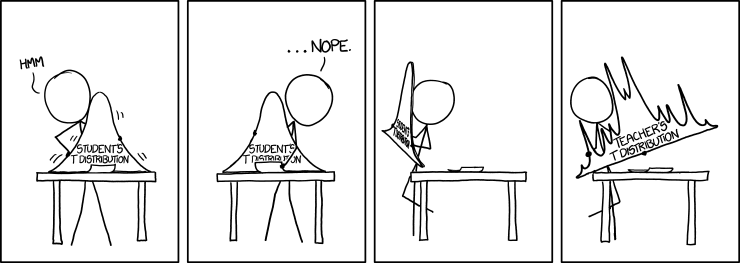

# Comparing Two Groups


## Learning Objectives 

1. 
2. 
3. 

## Class Announcements

- Great work completing your final w203 test!
- There is **no** unit 7 homework!
- The Hypothesis Testing Lab is released today! 
    - Lab is due at Unit 09 Live Session (two weeks)
    - Group lab in two parts: 
      - *Part 1*: Work as a team to engage the fundamentals of hypothesis tests
      - *Part 2*: Apply these fundamentals to analyze 2020 election data and write a single, three-page analysis
    

## Roadmap
**Rearview Mirror**

- Statisticians create a population model to represent the world
- A population model has parameters we are interested in
    - Ex: A parameter might represent the effect that a vitamin has on test performance
- A null hypothesis is a specific statement about a parameter
    - Ex: The vitamin has zero effect on performance
- A hypothesis test is a procedure for rejecting or not rejecting a null, such the probability of a type 1 error is constrained.

**Today**

- There are often multiple hypothesis tests you can apply to a scenario.
- Our primary concern is choosing a test with assumptions we can defend.
- Secondarily, we want to maximize power.

**Looking Ahead**

- Next week, we start working with models for linear regression
- We will see how hypothesis testing is also used for regression parameters.

## Teamwork Discussion

**Working on Data Science Teams** 

- Data science is a *beautiful* combination of team-work and individual-work
  - Teams:
    - Define research ambitions and scope
    - Imagine/envision the landscape of what is possible 
    - Support, discuss, review and integrate individual contributions
  - Individuals: 
    - Conduct the heads-down work that moves question answering forward 

**The Problematic Psychology of Data Science**

- People talk about the *impostor syndrome* -- a feeling of inadequacy or interloping that is sometimes also associated with a fear of under-performing relative to the expectation of others on the team.
  - These emotions are common through data science, academics, computer science.
  - But, the emotions are also commonplace in journalism, film-making, and public speaking
- What might be generating these feelings?

{width=25%}


**What Makes an Effective Team?**

- This reading on [*effective* teams](https://rework.withgoogle.com/print/guides/5721312655835136/) summarizes academic research to argue: 

> What really matters is less about who is on the team, and more about how the team works together. 

- In your live session, your section might take 7 minutes to read this brief, reading the problem statement, the proposed solution, and the framework for team effectiveness (stopping at the section titled *"Tool: Help teams determine their own needs."*) 

> "Psychological safety refers to an individual's perception of the consequences of taking an interpersonal risk. It is a belief that a team is safe for risk taking in the face of being seen as ignorant, incompetent, negative, or disruptive." 
> 
> "In a team with high psychological safety, teammates feel safe to take risks around their team members. They feel confident that no one on the team will embarrass or punish anyone else for admitting a mistake, asking a question, or offering a new idea."


### We All Belong

- From your experience, can you give an example of taking a personal risk as part of a team?
    - Can you describe your emotions when contemplating this risk?
    - If you did take the risk, how did the reactions of your teammates affect you?
  
- Knowing the circumstances that generate feelings of anxiety -- what steps can we take as a section, or a team, to recognize and respond to these circumstances? 

> How can you add to the psychological safety of your peers in the section and lab teammates?

- Only 26% of data science jobs are held by women.
  - Morgan Ames (a professor in the program, teaching w231), in [*The Charisma Machine*](https://mitpress.mit.edu/books/charisma-machine) (available for free through the [library](https://ebookcentral.proquest.com/lib/berkeley-ebooks/detail.action?docID=5968332), and with the introduction chapter [here](./ames_2019.pdf)) studies the One Laptop Per Child initiative, and argues that the failure of OLPC is (another) example of: 
  
- Sociological barriers that make broad-based, inclusive collaboration in tech challenging. 


> "One Laptop Per Child implicitly invokes the social imaginary of the technically precocious boy... This imaginary shows a “natural” mastery of technical toys as well as a particular kind of rebellious sensibility that enables technical tinkering—but is still exclusionary by connecting technical prowess to boys in particular." 

> "In contrast, I found that each [successful] student had a constellation of resources that encouraged them down this path: families that steered them toward creative and critical thinking, a focus on the importance of education, and in many cases another computer in the home. This account circumscribes the role of technology, [... and] instead highlights the importance of social worlds." 

- In the face of uneven challenges faced by under-represented peoples in data science, what actions can we take to produce an inclusive, integrated data science team?

## Team Kick-Off
**Lab 1 Teams**

- Here are teams for Lab 1! 

**Team Kick-Off Conversation**

- In a 10 minute breakout with your team, please discuss the following questions: 

1. How much time will you invest in the lab each week?
2. How often will you meet and for how long?
3. How will you discuss, review, and integrate individual work into the team deliverable?
4. What do you see as the biggest risks when working on a team?  How can you contribute to an effective team dynamic?

## A Quick Review
**Review of Key Terms**

- Define each of the following:
    - Population Parameter
    - Null Hypothesis
    - Test Statistic
    - Null Distribution

**Comparing Groups Review**

Take a moment to recall the tests you learned this week.  Here is a quick cheat-sheet to their key assumptions.

| paired/unpaired | parametric                                                                      | non-parametric                                          |
|-----------------|---------------------------------------------------------------------------------|---------------------------------------------------------|
| unpaired        | **unpaired t-test** <br> - metric var <br> - i.i.d. <br> - (not too un-)normal  | **Wicoxon rank-sum** <br> ordinal var <br> i.i.d. <br>  |
| paired          | **paired t-test** <br> metric var <br> i.i.d. <br> (not too un-)normal          | **Wicoxon signed-rank** <br> metric var <br> i.i.d. <br> difference is symmetric  <br> <br> **sign test** <br> ordinal var <br> i.i.d. |
   
## Comparing Groups R Exercise

The General Social Survey (GSS) is one of the longest running and extensive survey projects in the US.  The full dataset includes over 1000 variables spanning demographics, attitudes, and behaviors.  The file `GSS_w203.RData` contains a small selection of a variables from the 2018 GSS.  

To learn about each variable, you can enter it into the search bar at the [GSS data explorer](https://gssdataexplorer.norc.org/variables/vfilter)
    

```r
load('data/GSS_w203.RData')
summary(GSS)
```

```
##            rincome               happy                           sexnow   
##  $25000 or more: 851   very happy   : 701   women                   :758  
##  $20000 - 24999: 107   pretty happy :1307   man                     :640  
##  $10000 - 14999:  94   not too happy: 336   transgender             :  2  
##  $15000 - 19999:  61   DK           :   0   a gender not listed here:  1  
##  lt $1000      :  33   IAP          :   0   Don't know              :  0  
##  (Other)       : 169   NA           :   0   (Other)                 :  0  
##  NA's          :1033   NA's         :   4   NA's                    :947  
##      wwwhr           emailhr                     socrel   
##  Min.   :  0.00   Min.   :  0.000   sev times a week:382  
##  1st Qu.:  3.00   1st Qu.:  0.000   sev times a mnth:287  
##  Median :  8.00   Median :  2.000   once a month    :259  
##  Mean   : 13.91   Mean   :  7.152   sev times a year:240  
##  3rd Qu.: 20.00   3rd Qu.: 10.000   almost daily    :217  
##  Max.   :140.00   Max.   :100.000   (Other)         :171  
##  NA's   :986      NA's   :929       NA's            :792  
##              socommun      numpets          tvhours      
##  never           :510   Min.   : 0.000   Min.   : 0.000  
##  once a month    :243   1st Qu.: 0.000   1st Qu.: 1.000  
##  sev times a week:219   Median : 1.000   Median : 2.000  
##  sev times a year:196   Mean   : 1.718   Mean   : 2.938  
##  sev times a mnth:174   3rd Qu.: 2.000   3rd Qu.: 4.000  
##  (Other)         :215   Max.   :20.000   Max.   :24.000  
##  NA's            :791   NA's   :1201     NA's   :793     
##                      major1         owngun   
##  business administration: 138   yes    :537  
##  education              :  79   no     :993  
##  engineering            :  54   refused: 39  
##  nursing                :  51   DK     :  0  
##  health                 :  42   IAP    :  0  
##  (Other)                : 546   NA     :  0  
##  NA's                   :1438   NA's   :779
```

You have a set of questions that you would like to answer with a statistical test. **For each question**:

1. Choose the most appropriate test.
2. List and evaluate the assumptions for your test.
3. Conduct your test.
4. Discuss statistical and practical significance.

**The Questions**

- Do Americans with pets watch more or less TV than Americans without pets?
- Do economics majors watch more or less tv than computer science majors?
- Are Americans that own guns or Americans that don't own guns more likely to have pets?
- Do Americans spend more time emailing or using the web?
- Are Americans with pets happier than Americans without pets?
- Do Americans spend more evenings with neighbors or with relatives?
