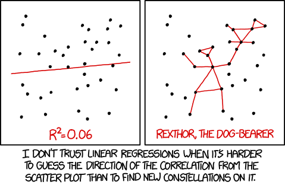

# OLS Regression Inference


## Learning Objectives 

1. 
2. 
3. 

## Class Announcements

1. Congratulations on finishing your first lab!
2. The next (and the last) lab is coming up in two weeks. 
2. Homework 09 has been assigned today, and it's due in a week.

## Roadmap

**Rear-View Mirror**

- Statisticians create a population model to represent the world.
- Sometimes, the model includes an "outcome" random variable $Y$ and "input" random variables $X_1, X_2,...,X_k$.
- The joint distribution of $Y$ and $X_1, X_2,...,X_k$ is complicated.
- The best linear predictor (BLP) is the canonical way to summarize the relationship.
- OLS provides a point estimate of the BLP

**Today**

- Robust Standard Error: quantify the uncertainty of OLS coefficients
- Hypothesis testing with OLS coefficients
- Bootstrapping

**Looking Ahead**

- Regression is a foundational tool that can be applied to different contexts
- The process of building a regression model looks different, depending on whether the goal is prediction, description, or explanation.

## Uncertainty in OLS
### Discussion Questions

- List as many differences between the BLP and the OLS line as you can.
- In the following regression table, explain in your own words what the standard error in parentheses means.

|               | outcome: sleep hours |
|---------------|----------------------|
| mg. melatonin |    0.52              |
|               |   (0.31)             |
   

### Understanding Uncertainty

Under the relatively stricter assumptions of constant error variance, the variance of a slope coefficient is given by

$$
  V(\hat{\beta_j}) = \frac{\sigma^2}{SST_j (1-R_j^2)}
$$

A similar formulation is given in *FOAS* as definition 4.2.3, 

$$
  \hat{V}_{C}[\hat{\beta}] = \hat{\sigma}^2 \left( X^{T} X \right)^{-1} \rightsquigarrow \frac{\hat{\sigma}^{2}}{\left( X^{T}X\right)}
$$

Explain why each term makes the variance higher or lower:

- $\sigma^2$ is the variance of the error $\epsilon$
- $SST_j$ is (unscaled) variance of $X_j$
- $R_j^2$ is $R^2$ for a regression of $X_j$ on the other $X$'s

## R Exercise
**Real Estate in Boston** 

The file `hprice1.RData` contains 88 observations of homes in the Boston area, taken from the real estate pages of the Boston Globe during 1990.  This data was provided by Wooldridge.


```r
load('data/hprice1.RData') # provides 3 objects 
```

Last week, we fit a regression of price on square feet. 


```r
model_one <- lm(price ~ sqrft, data = data)
model_one
```

```
## 
## Call:
## lm(formula = price ~ sqrft, data = data)
## 
## Coefficients:
## (Intercept)        sqrft  
##     11.2041       0.1402
```

**Questions**

1. Estimate a new model (and save it into another object) that includes the size of the lot and whether the house is a colonial. This will estimate the model: 

\[ 
  price = \beta_{0} + \beta_{1} sqrft + \beta_{2} lotsize + \beta_{3} colonial? + e
\] 

- *BUT BEFORE YOU DO*, make a prediction: What do you think is going to happen to the coefficient that relates square footage and price? 
  - Will the coefficient increase, decrease, or stay the same? 
  - Will the *uncertainty* about the coefficient increase, decrease, or stay the same? 
  - Conduct an F-test that evaluates whether the model *as a whole* does better when the coefficients on `colonial` and `lotsize` are allowed to estimate freely, or instead are restricted to be zero (i.e. $\beta_{2} = \beta_{3} = 0$. 


2. Use the function `vcovHC` from the `sandwich` package to estimate (a) the the heteroskedastic consistent (i.e. "robust") variance covariance matrix; and (b) the robust standard errors for the intercept and slope of this regression. Recall, what is the relationship between the VCOV and SE in a regression? 


3. Perform a hypothesis test to check whether the population relationship between `sqrft` and `price` is zero. Use `coeftest()` with the robust standard errors computed above. 


4. Use the robust standard error and `qt` to compute a 95% confidence interval for the coefficient `sqrft` in the second model that you estimated. $price = \beta_{0} + \beta_{1} sqrft + \beta_{2} lotsize + \beta_{3} colonial$. 

5. **Bootstrap.** The book *very* quickly talks about bootstrapping which is the process of sampling *with replacement* and fitting a model. The idea behind the bootstrap is that since the data is generated via an iid sample from the population, that you can simulate re-running your analysis by drawing repeated samples from the data that you have. 

Below is code that will conduct a boostrapping estimator of the uncertainty of the `sqrft` variable when `lotsize` and `colonial` are included in the model. 


```r
bootstrap_sqft <- function(d = data, number_of_bootstraps = 1000) { 
  number_of_rows <- nrow(d)

    coef_sqft <- rep(NA, number_of_bootstraps)

    for(i in 1:number_of_bootstraps) { 
      bootstrap_data <- d[sample(x=1:number_of_rows, size=number_of_rows, replace=TRUE), ]  
      estimated_model <- lm(price ~ sqrft + lotsize + colonial, data = bootstrap_data)
      coef_sqft[i]    <- coef(estimated_model)['sqrft']
    }
  return(coef_sqft)
  }
```


```r
bootstrap_result <- bootstrap_sqft(number_of_bootstraps = 1000)
```

With this, it is possible to plot the distribution of these regression coefficients: 


```r
ggplot() + 
  aes(x = bootstrap_result) + 
  geom_histogram() + 
  labs(
    x = 'Estimated Coefficient', 
    y = 'Count', 
    title = 'Bootstrap coefficients for square footage'
  )
```

```
## `stat_bin()` using `bins = 30`. Pick better value with `binwidth`.
```

<!-- --> 

Compute the standard deviation of the bootstrapped regression coefficients.  How does this compare to the robust standard errors you computed above?
